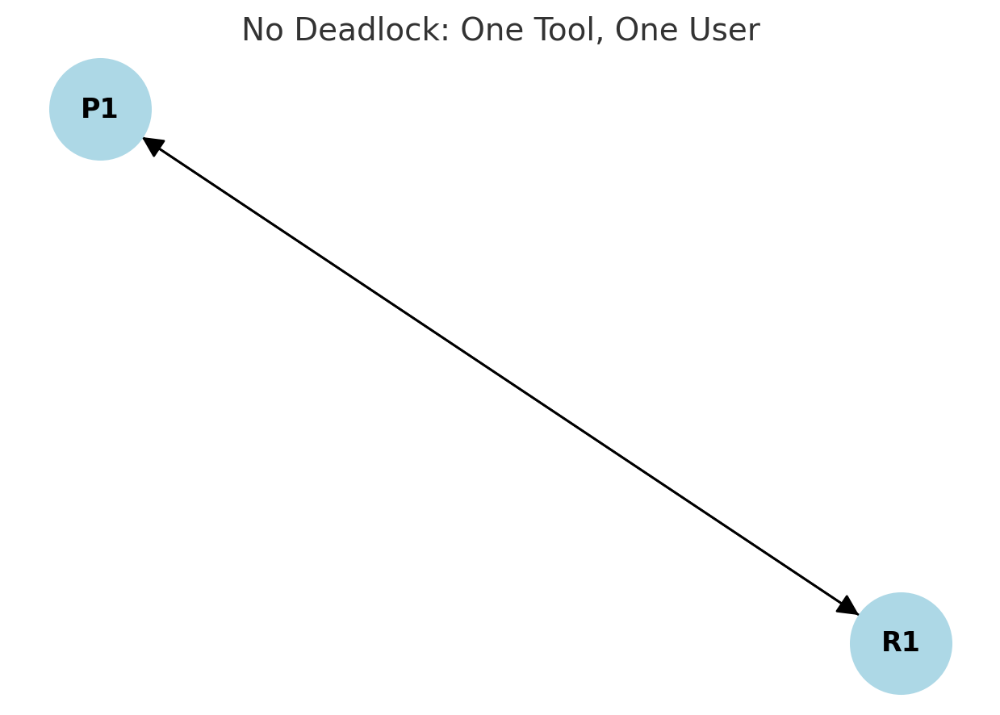
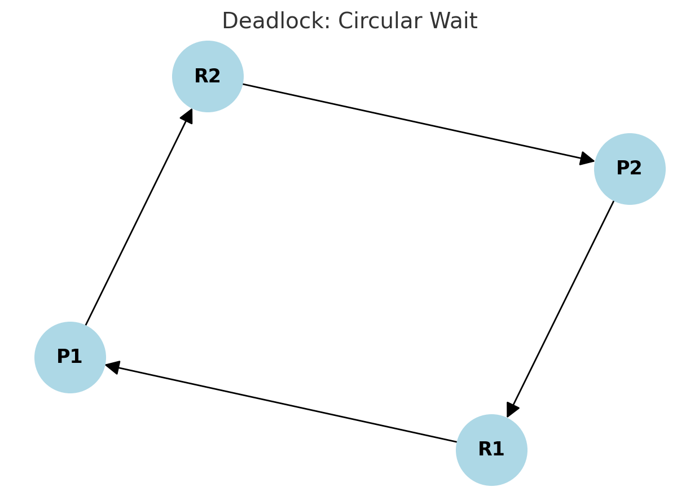
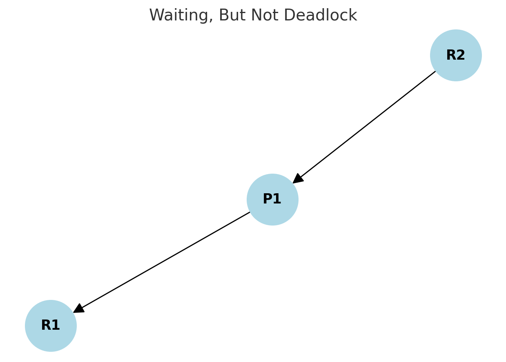
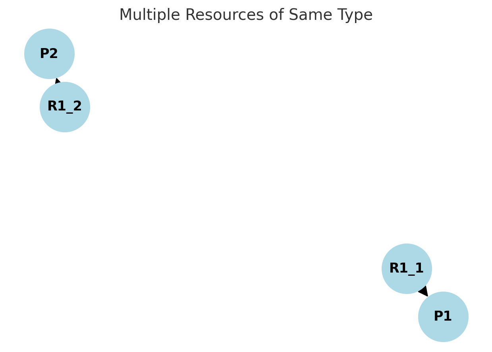
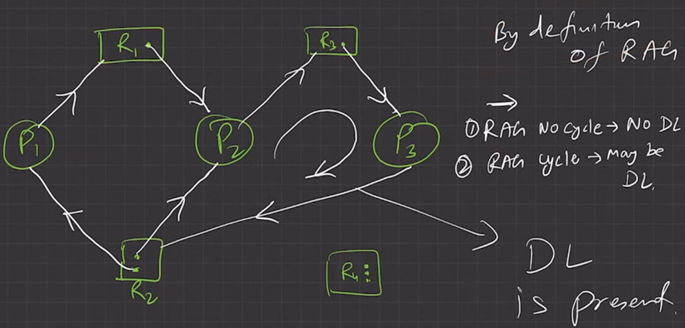
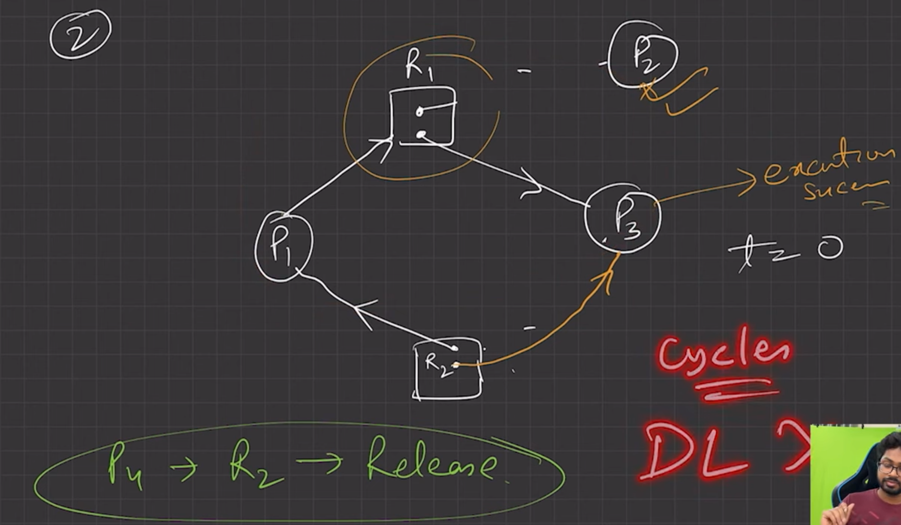

## 💡 What is a Resource Allocation Graph (RAG)?

A **Resource Allocation Graph (RAG)** is a simple way to **show who is using what** and **who is waiting for what** in a system.

You can think of it like a drawing (or a map) of:

* **Processes (programs)** – asking for or using things.
* **Resources (things they need)** – like a printer, file, or CPU.

It helps us **visualize**:

* Which process is holding a resource.
* Which process is waiting for a resource.
* Whether there's a chance of **deadlock** happening.

---

## 🔷 Vertex (Plural: Vertices)

A **vertex** just means a **dot** (or a circle) in the graph.

There are two types of vertices:

* **Process** → Represented by a **circle**
  Example: `P1`, `P2`, etc.

* **Resource** → Represented by a **square**
  Example: `R1`, `R2`, etc.

---

## 🔗 Edges (Lines)

Edges are **arrows** that connect processes and resources.

Two types:

### ➡️ Request Edge:

* From **process** to **resource**
* Means: Process **wants** the resource
* Shown as: `P1 → R1`

### ➡️ Assignment Edge:

* From **resource** to **process**
* Means: Resource is **given** to the process
* Shown as: `R1 → P1`

---

## ✏️ Visual Diagrams in Text Format

Here are examples using **text format**:

---

### ✅ **1. No Deadlock (Simple)**

```txt
P1 → R1 → P1
```

Explanation:

* `P1 → R1`: P1 is requesting R1
* `R1 → P1`: R1 is assigned to P1
* There’s no deadlock here; P1 got what it wanted.

---

### 🔁 **2. Circular Wait (Deadlock)**

```txt
P1 → R1 → P2 → R2 → P1
```

Explanation:

* `P1` wants `R1`, but `R1` is with `P2`
* `P2` wants `R2`, but `R2` is with `P1`
* This is a **circle** — no one can move → 💀 **Deadlock**

---

### ⏳ **3. Waiting but Not Deadlock**

```txt
P1 → R1
R2 → P1
```

Explanation:

* P1 is **waiting** for R1
* P1 is **using** R2
* No loop → Not deadlock (but if others get involved, it can become one)

---

## 🔄 Types of Resource Allocation Graphs

### 1. **Basic RAG**

* Just shows who is using or requesting what.
* No extra info.

### 2. **RAG with Multiple Instances**

* What if we have more than 1 unit of a resource? (e.g., 3 printers)
* In this case, each unit is shown as a **dot inside the resource box**.

Example:

```txt
  R1 [3 units] → P1
      ↑
     P2
```

* `R1` has 3 instances (like 3 printers).
* `P1` is using 1.
* `P2` is requesting 1.

---

## ❓Why Use Resource Allocation Graphs?

* Easy to **see potential deadlocks**
* Helps **design better systems**
* Good for **understanding current system state**
* Used in **deadlock detection algorithms**

---

## ✅ Summary in Plain English

* A **Resource Allocation Graph** is like a map of which programs (processes) are using or waiting for which things (resources).
* **Circles = Processes**
* **Squares = Resources**
* Arrows (edges) show who is **asking** or **holding** something.
* If there’s a **circle (loop)** in the graph, that’s a **deadlock**.
* RAG is very useful to **check for problems** in how resources are being shared.

---
---
---

## 🧠 Think of a Real-Life Example: Office with Employees & Tools

Imagine an office with **employees (processes)** and **tools (resources)**:

* 👨‍💼 **P1 = Employee A**
* 👩‍💼 **P2 = Employee B**
* 🖨️ **R1 = Printer**
* 🖥️ **R2 = Computer**

---

### ✅ Example 1: No Deadlock — One Tool, One User

### Scenario:

* Employee A (P1) needs the Printer (R1), and he gets it.

### Diagram:

```txt
P1 → R1 → P1
```

### Image:



### Meaning:

* P1 wants the printer → R1
* R1 is given to P1 → back arrow
* No problem, work goes on 👍

---

### 🔄 Example 2: Deadlock — Circular Wait

### Scenario:

* P1 has the Printer (R1), but wants Computer (R2)
* P2 has the Computer (R2), but wants Printer (R1)

### Diagram:

```txt
P1 → R2
R2 → P2
P2 → R1
R1 → P1
```

### Image:



### Meaning:

* This is a circle: Everyone’s waiting, no one can move ➡️ 💥 **Deadlock**

---

### ⏳ Example 3: Waiting but Not Deadlock

### Scenario:

* P1 has R2 (Computer)
* P1 is also waiting for R1 (Printer)
* But no one else is involved

### Diagram:

```txt
R2 → P1
P1 → R1
```

### Image:



### Meaning:

* P1 is working but needs more
* No loop → this is just waiting, not deadlock

---

### 🔢 Example 4: Multiple Resources of Same Type

### Scenario:

* R1 = Printer with 2 units
* P1 is using one printer
* P2 is requesting another printer

### Text Diagram:

```txt
   [R1 (2 units)]
      •     •
     ↓      ↓
   P1     P2
```

### Image:



### Meaning:

* Resource has more than 1 unit
* We track usage per unit
* Good for showing multiple resource systems

---

## 🛠 Real-World Uses of RAG:

| Use Case                      | How RAG Helps                          |
| ----------------------------- | -------------------------------------- |
| Operating Systems             | To track which process is using what   |
| Deadlock Detection Algorithms | To find cycles (loops = deadlock)      |
| Debugging Parallel Programs   | Understand blocked threads or deadlock |
| Resource Scheduling           | Decide best way to give out resources  |

---

## Summary

* **Resource Allocation Graph (RAG)** helps visualize resource usage and potential problems.
* **Circle = Process**, **Square = Resource**
* **Arrow from Process → Resource = Request**
* **Arrow from Resource → Process = Allocated**
* **Loop = Danger! Deadlock can happen**
* Helps OS designers and developers avoid resource mismanagement


---
---
---

### ✅ **Resource Allocation Graph (RAG) — Very Brief Explanation**

* **Used in OS** to model how **resources** are assigned to or requested by **processes**.
* **Purpose**: Detect or avoid **deadlock**.


### 🔹 **Basic Terms**

| Term       | Meaning                                                      |
| ---------- | ------------------------------------------------------------ |
| **Vertex** | Circle = Process (e.g. P1, P2), Box = Resource (e.g. R1, R2) |
| **Edge**   | Arrow showing request or allocation                          |

* `P → R` = Process requests Resource
* `R → P` = Resource is allocated to Process


### 🔹 **Deadlock (DL) Rules**

1. **No cycle in RAG** ⇒ No Deadlock
2. **Cycle in RAG** ⇒ *May* or *May not* be a Deadlock

   * If **each resource has 1 instance**, then **Cycle ⇒ Deadlock**
   * If **resource has multiple instances**, cycle *may not* mean deadlock

---

### 📌 **Diagram 1 Explanation**

#### 📷 Image 1:



This shows:

* Processes: P1, P2, P3
* Resources: R1, R2
* All edges form a **Cycle**:
  `P1 → R1 → P2 → R2 → P3 → R1 (again)`

✅ **Cycle present → Deadlock is present**

🧠 **Why DL?**

* Every process is **waiting** for a resource that another process is holding.
* No one can proceed — system is **stuck** → **Deadlock**.

---

### 📌 **Diagram 2 Explanation**

#### 📷 Image 2:



* This one **looks like a cycle**, but it is **not** a deadlock.
* Here's what happens:

* **Processes**: P1, P2, P3
* **Resources**: R1, R2
* **Arrows**:

  * `P1 → R1` (P1 is requesting R1)
  * `R1 → P3` (R1 is allocated to P3)
  * `P3 → R2` (P3 is requesting R2)
  * `R2 → P2` (R2 is allocated to P2)

---

### ✅ **Correct Analysis**

```text
P1 → R1 → P3 → R2 → P2
```

### 🔁 **Cycle Exists**?

Yes. But let’s analyze this carefully:

* **R1 is allocated to P3**, and **P3 is waiting for R2**
* **R2 is allocated to P2**, and **P2 is not waiting for anything**

### 🧠 So, is it a Deadlock?

**No.**

* Even though there's a **path**, it's not a **closed cycle** like:

  ```
  P1 → R1 → P2 → R2 → P1
  ```
* Here, **P2 is not requesting anything**, so eventually **P2 can finish and release R2**, which allows **P3** to proceed, then **P1**.

---

### ✅ Final Conclusion

| Point                 | Correct         |
| --------------------- | --------------- |
| P4 exists in diagram? | ❌ No (Mistake)  |
| Is there a cycle?     | ❌ No true cycle |
| Deadlock present?     | ❌ No            |
