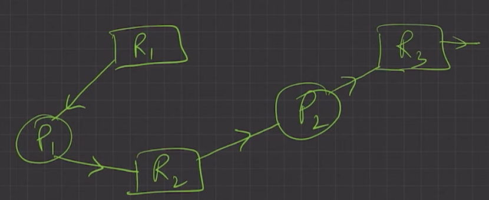
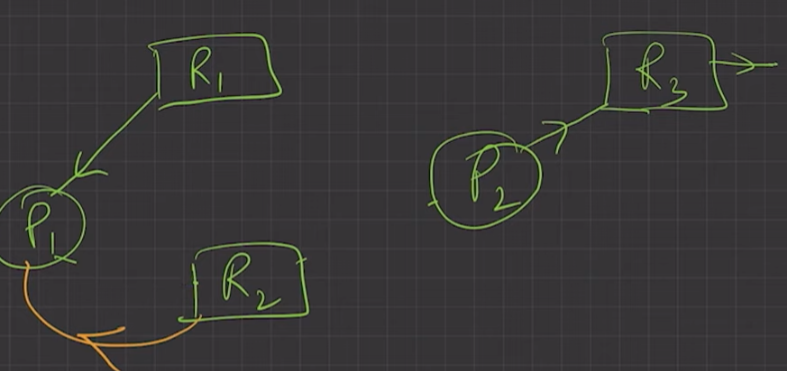
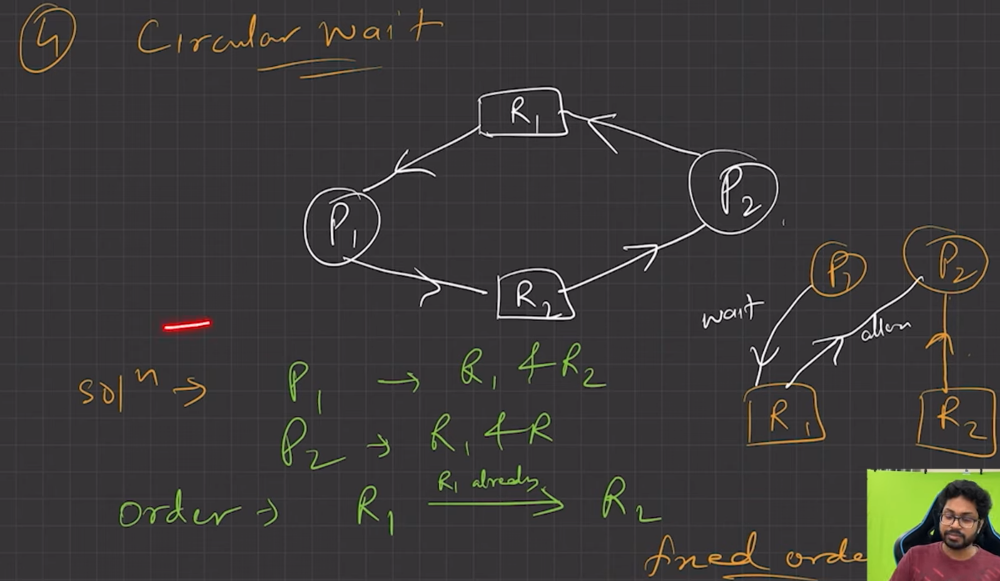

## ✅ **Deadlock Prevention**

This means **we try to stop deadlock from happening in the first place**.
To do this, we make sure that **at least one of the 4 deadlock conditions** (that we talked about earlier) **never happens**.

Let’s see **how to prevent each condition**:

---

### **a. Mutual Exclusion**

This means that some resources can't be shared — only one person or process can use it at a time.

* **i. Use locks only for non-shareable resources**

  * Example: A printer is a non-shareable resource — only one person can print at a time. So, we lock it when someone uses it.
  * But files like **read-only PDFs** can be shared by multiple people — no need to lock.

* **ii. Sharable resources like Read-Only files can be accessed by many**

  * Think of a **library book placed in a reading room**. Everyone can read it, but no one can take it home — it's shared.

* **iii. We can’t prevent deadlocks by denying mutual exclusion**

  * Some things, like printers or pens (in the real world), **just can’t be shared**. So, we **must allow** mutual exclusion for them. You can't stop deadlocks by ignoring this condition completely.

---

### **b. Hold and Wait**

This means a process is **holding one resource** while **waiting for another**.

* **i. To prevent this, make sure the process doesn't hold anything when requesting a new resource**

  * Example: Imagine you're booking two train tickets for a round trip. You shouldn't be allowed to hold one ticket and wait for the other. Instead, you should get **both tickets together** or **none at all**.

* **ii. Protocol A: Ask for everything at once before starting**

  * Example: Before baking a cake, you collect **all ingredients** (flour, eggs, sugar) at once. You don't start baking with just flour and then ask for eggs later.

* **iii. Protocol B: Ask only when you have nothing**

  * Example: You finish using all your cooking tools and return them. Only then you ask for new ones. You never hold one tool while asking for another.

---

### **c. No Preemption**

This means a process shouldn't keep resources if it can't use them right now.

* **i. If a process can’t get all it needs, take away what it already holds**

  * Example: Imagine a student uses a projector and laptop to present, but the mic isn’t available. Instead of keeping the projector and laptop idle, we take them back so others can use them, and the student tries again later.

* **ii. Before giving resources, check if they are free. If not, take them from others if needed**

  * Example: You want a table and chair to study. If someone is sitting with the chair but not using the table, we may ask them to give up the table so you can use both together. This can cause issues like ***live-lock***, where people keep exchanging resources but no one actually gets to use them fully.

---
---
---

### ✅ **Image 3: Initial Scenario (Resource Allocation Graph)**


#### What’s in the Diagram:

* **Processes:**

  * `P1` and `P2` are two processes (like programs or users trying to do tasks).
* **Resources:**

  * `R1`, `R2`, and `R3` are resources (could be like printer, disk, or a study table).
* **Arrows:**

  * A **line from resource to process** = resource is **assigned** to the process.
  * A **line from process to resource** = process is **requesting** that resource.

#### What is happening:

* `P1` is **holding** `R1` and **asking** for `R2`.
* `R2` is currently **held by** `P2`, who is **asking** for `R3`.
* `R3` is **free** (not assigned to any process).

So this chain looks like:

```
P1 → R2 → P2 → R3
P1 holds R1
```

➡️ In simple terms:

* `P1` has the table (`R1`), wants a chair (`R2`), but someone else (`P2`) is using it.
* `P2` wants something else (`R3`), which is currently free.

---

### 🔁 **Image 4: System Tries to Reallocate (Resource Preemption)**


Here’s what changes in Image 4:

* **`R2` is taken away from `P2` and given to `P1`.**
* `P1` now has both `R1` and `R2`, and it can **continue** and **complete** its task.
* Meanwhile, `P2` still waits for `R3`.

#### What does this mean?

* The system **preempted (took back)** resource `R2` from `P2` and gave it to `P1`.
* Now `P1` can finish, and after that, it will release `R1` and `R2`.
* Then `P2` can get `R2` (once it's free) and proceed after getting `R3`.


### 📚 Real-life Analogy

Imagine:

* **P1** is a student with a **table** (`R1`) but needs a **chair** (`R2`) to study.
* **P2** is a student with the **chair** (`R2`) but wants the **lamp** (`R3`) to study.
* The **lamp** is free.

Now the teacher steps in and says:

> “P2, please give the chair to P1. Once P1 is done, you’ll get both the chair and lamp.”

This **temporary sacrifice** helps avoid a deadlock and keeps the system moving.


### 🧠 Final Summary

* **Image 3** shows a possible **deadlock chain** starting to form.
* **Image 4** shows how the **system can break the chain** by **preempting a resource** (taking it from one process and giving to another).
* This helps ensure progress and avoids a deadlock — though if not managed well, it can lead to **livelock** (where processes keep waiting or getting preempted without making progress).

---
---
---

### **d. Circular Wait**

This happens when each process is waiting for a resource held by the next — forming a circle.

* **i. Prevent by having a proper order**

  * Example: Set a rule — always book **Room A before Room B**. No exceptions.

* **ii. Example with processes P1 and P2 needing R1 and R2**

  * P1 locks R1 and waits for R2.
  * P2 locks R2 and waits for R1.
  * Both are stuck, waiting forever — this is a deadlock.

  To solve this: make a rule like **always lock R1 first, then R2**. So, no one will try to lock R2 before R1 — this avoids the circular waiting.

---
---
---



This image explains the **Circular Wait** condition in operating systems and how to **prevent** deadlocks by avoiding this condition. Let’s break it down step by step in a **simple, beginner-friendly way**.

## 💥 What is Circular Wait?

Circular Wait is **one of the four necessary conditions** for a **deadlock** to happen.

### 🔄 Circular Wait means:

> A set of processes are **waiting for each other in a circular chain** to release a resource.

#### In the diagram above (top-center graph):

* `P1` → waiting for `R2`
* `P2` → waiting for `R1`
* But:

  * `P1` is already holding `R1`
  * `P2` is already holding `R2`

So:

```
P1 → R2 → P2 → R1 → P1
```

✅ This is a **circular wait** — a classic deadlock!

## 🧠 How to Prevent Circular Wait?

### ✅ The Solution (bottom left): Use a **Fixed Resource Allocation Order**

This means:

* Resources must always be **requested in a fixed order**, like:

  ```
  R1 → R2 → R3 → ...
  ```

### 🔁 How does this help?

#### Example in the diagram:

* **Order:** `R1` must be requested before `R2`.

So:

* If `P1` wants `R1` and `R2`, it asks in the order:

  * `P1` → `R1`, then `R2` ✅
* If `P2` also needs `R2`, it must **first get `R1`** (because `R1 < R2`).

  * But `R1` is already taken by `P1`, so `P2` will wait.

Because of the strict ordering, no circular chain like `P1 → R2 → P2 → R1` can be formed.

➡️ This **breaks the circular wait** and **prevents deadlock**.

## 🧱 Visual Representation (Right Side Diagram)

The blocks with arrows show:

* `P1` is **waiting** for `R2`
* `P2` is **holding** `R2` but **needs `R1`**, which it’s not allowed to request now
* Due to fixed order (must ask for `R1` before `R2`), `P2` **cannot make an invalid request**

Thus, deadlock is avoided 🚫.

## 🎯 Final Takeaway

### 🔒 Deadlock Prevention Rule:

> **Never allow circular wait** by enforcing a **fixed order of resource requests**.

By following:

```
Always ask for resources in a specific order (like R1 < R2 < R3)
```

you **guarantee** that circular waiting cannot happen — and so deadlocks are avoided.

---

### **Summary:**

To **prevent deadlocks**, we stop one of the following conditions:

1. **Mutual Exclusion**: Don't use locks unless the item can't be shared.
2. **Hold and Wait**: Don't allow holding one thing and asking for another.
3. **No Preemption**: Take back resources if all needed items aren't available.
4. **Circular Wait**: Set a strict order of requesting resources.