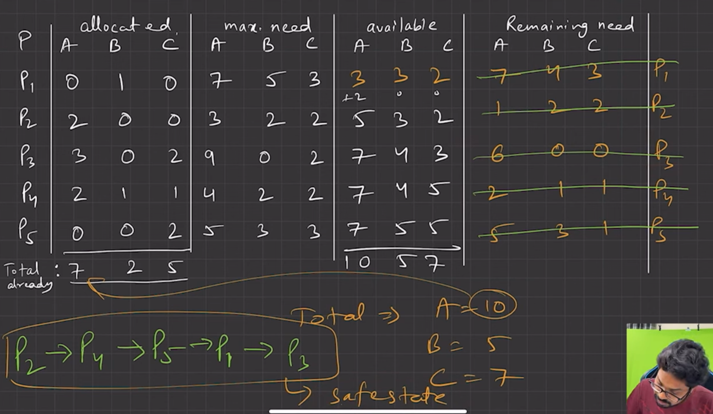

This image explains **Banker's Algorithm**, a deadlock avoidance algorithm used in operating systems. It ensures the system is in a **safe state**, meaning there's at least one sequence of process execution where all processes can complete without deadlock.

---

## 🔍 WHAT'S IN THE IMAGE?

The image contains the following key tables and steps:

---

### **1. Allocation Table**

Represents currently allocated resources (A, B, C) to each process (P1 to P5):

| Process             | A | B | C |
| ------------------- | - | - | - |
| P1                  | 0 | 1 | 0 |
| P2                  | 2 | 0 | 0 |
| P3                  | 3 | 0 | 2 |
| P4                  | 2 | 1 | 1 |
| P5                  | 0 | 0 | 2 |
| **Total allocated** | 7 | 2 | 5 |

---

### **2. Max Need Table**

Maximum resources each process may need in total:

| Process | A | B | C |
| ------- | - | - | - |
| P1      | 7 | 5 | 3 |
| P2      | 3 | 2 | 2 |
| P3      | 9 | 0 | 2 |
| P4      | 4 | 2 | 2 |
| P5      | 5 | 3 | 3 |

---

### **3. Available Resources**

These were calculated by:

* Total System Resources this will be given in the question

```
Available = Total System Resources - Allocated 
=> A: 10 - 7 = 3
   B: 5 - 2 = 3
   C: 7 - 5 = 2
```

These are the resources currently available (not allocated):

| A | B | C |
| - | - | - |
| 3 | 3 | 2 |

---

### **4. Remaining Need Table**

Calculated as:

```
Remaining Need = Max Need - Allocated
```

| Process | A | B | C |
| ------- | - | - | - |
| P1      | 7 | 4 | 3 |
| P2      | 1 | 2 | 2 |
| P3      | 6 | 0 | 0 |
| P4      | 2 | 1 | 1 |
| P5      | 5 | 3 | 1 |

---

## 🧠 RULES OF BANKER'S ALGORITHM:

1. **Check which process can be executed**: Its **Remaining Need of one process ≤ Available of another process**.
2. If such a process exists:

   * "Execute" it: Add its allocated resources back to Available.
   * Mark it as finished.
   * Repeat step 1.
3. If all processes can finish in some order => system is in a **safe state**.
4. If you get stuck (no process can be executed) => **unsafe state** (risk of deadlock).

---

## ✅ STEP-BY-STEP SAFE SEQUENCE EXPLAINED:

Initial Available: `A=3, B=3, C=2`

### 🔹 Step 1: P2 can be executed because (P2 remaining need ≤ P1 available)

* Need: `1,2,2` ≤ Available `3,3,2`
* After P2 finishes, release its allocation: `+2,0,0`
* Add the allocation to P1 available and put it in P2 (Dont change P1)
* New Available of P2 is: `5,3,2`

### 🔹 Step 2: P4 can be executed because (P4 remaining need ≤ P2 available)

* Need: `2,1,1` ≤ `5,3,2`
* Release its allocation: `+2,1,1`
* Add the allocation to P2 available and put it in P3 (Dont change P2) (if you are thinking that the addition should put in P4 thats not gonna happen, because we cant jump one step like this, so we have to put it in P3)
* New Available of P3 is: `7,4,3`

### 🔹 Step 3: P5 can be executed

* Need: `5,3,1` ≤ `7,4,3`
* Release: `+0,0,2`
* New Available of P4 is: `7,4,5`

### 🔹 Step 4: P1 can be executed

* Need: `7,4,3` ≤ `7,4,5`
* Release: `+0,1,0`
* New Available of P5: `7,5,5`

### 🔹 Step 5: P3 can be executed

* Need: `6,0,0` ≤ `7,5,5`
* Release: `+3,0,2`
* Now Total Available Becomes: `10,5,7`

✅ **Safe Sequence:**

```
P2 → P4 → P5 → P1 → P3
```

---

## 🟢 CONCLUSION:

The system is in a **safe state** as there exists at least one sequence where all processes can complete without deadlock.

---
---
---


Great question! Let's assume if **P3’s remaining need changes from `6 0 0` to `8 0 0`**.

Then, P3 **cannot execute** because it needs `8 A`, but only `7 A` is available. Since no other processes are left to run and free resources, we are stuck.

👉 **This is an UNSAFE STATE**.

> ❗Unsafe doesn’t necessarily mean deadlock has happened, but it **can happen** if P3 requests resources and the system grants it.