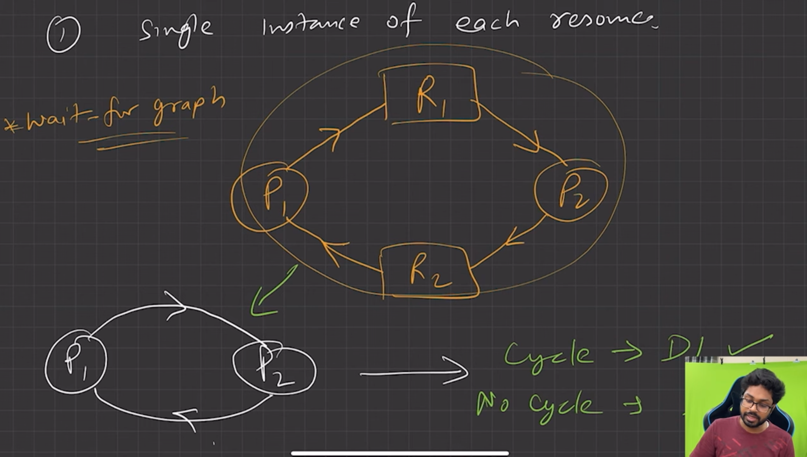

## 🔐 3. **Deadlock Detection**

Let’s say your computer system is like a **classroom full of students (processes)** who all need **markers, duster, and a projector (resources)** to complete their tasks. But there's a **limited number** of these things.

Now imagine a situation:

* One student takes the marker and waits for the projector.
* Another has the projector and waits for the marker.
* Both are stuck — **this is deadlock**.

If your classroom doesn't have strict rules to **prevent** this from happening or doesn't **avoid** such situations smartly (like Banker’s algorithm), then it needs to be smart enough to **detect** when this kind of problem (deadlock) **has already happened** and then fix it.

---

### 🔸 a. **Single Instance of Each Resource Type (Wait-For Graph)**

🧠 **What it means:**
Each resource (like marker, duster, projector) has **only one copy**. No duplicates.

#### 🧱 What’s a "Wait-for Graph"?

Imagine every student is a **circle**, and if Student A is waiting for Student B to return a resource, you draw an **arrow** from A to B.

* If the arrows form a **loop (cycle)**, it means that students are stuck waiting on each other in a circle — **no one can move**.
* That loop means: **Deadlock has occurred**.

📌 So:

> If there's a **cycle** in the wait-for graph, there is a **deadlock**.

🔁 The system (computer) checks this **from time to time**, like a teacher walking in to see if any students are just staring at each other and doing nothing — and then tries to solve the issue.

---

### 🔸 b. **Multiple Instances of Each Resource (Banker’s Algorithm)**

🧠 **What it means:**
Now there are **several copies** of each resource — like 3 markers, 2 projectors, etc.

You can't use a simple "arrow graph" here. So, we use something smarter: the **Banker's Algorithm**.

#### 🏦 Why is it called Banker's Algorithm?

Think of it like a **bank** giving out loans. A banker only gives out money (resources) **if** they are confident they’ll get it back without going bankrupt.

So:

* Processes request resources (like customers asking for money).
* The system checks: **“If I give this much, can I still serve everyone safely in some order?”**
* If yes: give the resources.
* If no: make the process wait.

This is how the system **avoids deadlocks** or detects when one is about to happen.

---

## 🛠 4. **Recovery from Deadlock**

Okay, imagine the system detects a deadlock. Now what?

Like the teacher found students stuck in a loop — we have to **break the cycle**.

Here are two ways:

---

### 🔴 a. **Process Termination**

This is the brutal but simple way.

#### i. Abort all Deadlocked Processes

💥 "Everyone stop what you’re doing and leave."

* Ends all processes that are stuck.
* Frees up all resources immediately.
* But this is harsh — data might be lost, and it wastes effort.

#### ii. Abort one process at a time

🔁 The system picks one stuck process at a time and ends it.

* After each termination, check if the deadlock is broken.
* This is more careful and less destructive.
* But it takes longer.

📌 It's like asking one student to give up and leave until the remaining ones can finish their work.

---

### 🔁 b. **Resource Preemption**

Instead of kicking students out, we take away their resources and give them to others.

* Select a process and **forcefully take its resource**.
* Give it to another process that might help break the deadlock.

⚠️ But this has issues:

* The process that lost the resource is **interrupted** (may crash or restart).
* You need to **roll back** the process to a safe point (like reloading a saved game).
* You need to decide:

  * Which process to take from?
  * Will it be able to continue later?

---

## 🔚 Final Thoughts (Friendly Summary):

* 🧱 **Wait-For Graph** is like students waiting in a circle. If there’s a loop, they’re deadlocked.
* 🏦 **Banker’s Algorithm** is like a careful banker who makes sure giving out resources won't cause trouble later.
* 💥 **Recovery** means either:

  * ❌ Stopping students (processes),
  * 🔁 Taking back resources and giving them to others.

If this sounds like real-life group projects where no one finishes unless someone gives up — it kind of is! 😄

