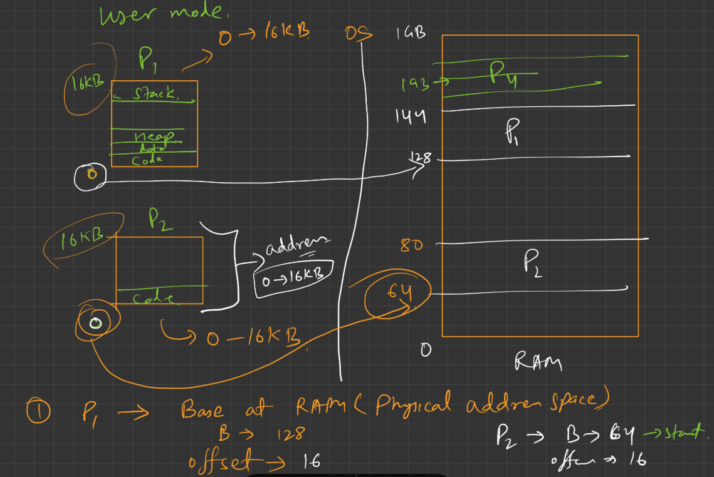

### 🧠 **Main Idea: Why Do We Need This?**

Imagine you’re at a library 📚 where many students are working on their projects. There’s only **one table (CPU)**, but many students **take turns** to sit and do their work. All students can’t sit together, so the librarian (your Operating System) has to be smart and keep track of **who is doing what**, **where their stuff is**, and **who gets to sit next**.

This is like your **multi-programming environment** — where many programs (students) are in line (ready queue), waiting their turn on the CPU (table), and all of them are using **shared memory (bookshelves)**.

---

## 🔁 Why Share Memory?

Just like students can’t each have their own table and entire library, computers can’t give each program its own personal memory. So, programs **share** main memory. That means the system has to **manage memory carefully** so no one messes up someone else's stuff.

---

## 🧭 Now let’s talk about Addresses: Logical vs Physical

---

### 🎯 Imagine You Want to Visit a Room in a Hotel:

* You ask the receptionist, “Where’s Room 101?”
* The receptionist says, “Go to Floor 2, take a left, third door.”

Now here's the magic:

* **“Room 101”** is like the **Logical Address** (what you think or use).
* **“Floor 2, third door”** is like the **Physical Address** (where it actually exists).

---

### 💻 Back to Computers: What is a **Logical Address**?

🧠 **It’s the address your program thinks it’s using.**

* The CPU generates this address when the program runs.
* Your program believes it lives in a nice, tidy apartment (like 0 to 1000).
* This is the **Virtual Space**, like a fantasy map.
* It doesn’t **exist physically** in the RAM.
* It’s like saying, “I want to go to 101” — but not knowing where that room actually is in the building.

📌 Key Points:

* Logical address is what the user/program sees.
* Doesn’t exist in the real RAM yet.
* Range: 0 to max (for that program).
* Aka: **Virtual Address**.

> **"Range: 0 to max (for that program)"** — in the context of **Logical Address Space**

## 🧠 What It Means (in Simple Terms)

This line is talking about the **range of logical addresses** a **program (process)** can use **while it is running**.

### 🔹 Logical Address Range: `0 to max`

* **0** → This is the **starting** address of the program’s memory (virtual memory).
* **max** → This is the **last valid logical address** the program can access.

So the program’s memory looks like:

```
Logical Address Space:
---------------------------------
0            → Beginning (like main function)
...
5000         → Code or variable
...
1,000,000    → Maybe end of allocated memory (this is the "max")
```

## 🧩 Why "0 to max"?

Because:

* Every process **thinks** it owns all the memory starting from **address 0** to some maximum size (`max`).
* That range (0 to max) is decided by:

  * The **OS**,
  * The **amount of memory requested** (e.g. through malloc, new, or stack/heap size),
  * System limitations (e.g. 32-bit systems = max \~4GB per process).

Each program has its own **logical address space** that starts at 0. It doesn’t matter where it's placed **physically** in RAM — the process only sees its own logical world.

## 📌 Visual Example

Let’s say a simple program is running.

### Logical Address Space:

```
0x00000000 → Start of program
0x00002000 → Code section
0x00004000 → Data section
0x00008000 → Stack start
0x0000FFFF → max address (end of virtual space)
```

This "0 to max" is **virtual** — created for each process by the OS.

---

### In computer terms:

* The **logical address** (also called **virtual address**) is the address **generated by the CPU during program execution**.
* It is the address **used inside the program** to access instructions or data.

### 🧠 Why does the CPU generate logical addresses?

Because each process **thinks** it is running in its own memory starting from address 0 ( Read 03_addres_zero.md to know what it is ).
This abstraction simplifies programming — the process doesn't care where in actual RAM its memory is.

---

### 💽 What is a **Physical Address**?

🧠 **It’s the real location in the RAM (main memory).**

* The actual memory chips in your computer have rows and cells where data is stored.
* That is where the instructions and data really go.
* Your program can’t **directly** access it — the system manages that behind the scenes.

📌 Key Points:

* Physical address = actual spot in RAM.
* User can’t directly see or control it.
* Range: starts from some base number (like R) and goes up (R + max).

### In computer terms:

* The **physical address** is the **actual location in RAM** where data/instructions are stored.
* It is the address **used by the memory hardware** to access RAM.

So:

| Address Type     | Who generates it?   | Where it exists?        | Who uses it?           |
| ---------------- | ------------------- | ----------------------- | ---------------------- |
| Logical Address  | CPU                 | Virtual Address Space   | Program / User         |
| Physical Address | MMU (after mapping) | Real RAM (Memory Chips) | Memory Unit (Hardware) |


### 🔄 How are Logical Addresses converted to Physical Addresses?

This is done using a hardware component called the **MMU (Memory Management Unit)**.

### 🎯 Address Translation:

* The **MMU** uses a mapping mechanism to convert logical → physical addresses.
* This mapping can be done using:

  * **Base and limit registers** (for simple systems),
  * Or **page tables** (used in modern OSes with virtual memory).

---
---
---

### 🔹 Logical Address vs Physical Address

#### **1. Logical Address:**
- This is the **address used by the program** (or the process) while it is running.
- Also called a **virtual address**.
- It ranges **from 0 up to the program's size**.
- Each program thinks it starts at address **0**, regardless of where it is actually stored in RAM.

#### **2. Physical Address:**
- This is the **actual address in RAM (main memory)** where the program is loaded.
- Set by the **Operating System** and **Memory Management Unit (MMU)**.
- It can be **anywhere in the RAM**, depending on what memory is free.

---


### 🔸 Example (Based on What You Gave):

#### Suppose:
- **Program A** size: 16 KB (Logical address range: `0 to 16 KB`)
- **Program B** size: 16 KB (Logical address range: `0 to 16 KB`)

But they are loaded into RAM at different physical locations:

- **Program A** is loaded at `128 KB` to `144 KB` in physical memory.
- **Program B** is loaded at `64 KB` to `80 KB` in physical memory.

#### So we have:

| Program | Logical Address Range | Physical Address Range |
|--------|------------------------|-------------------------|
| A      | 0 KB – 16 KB           | 128 KB – 144 KB         |
| B      | 0 KB – 16 KB           | 64 KB – 80 KB         |

💡 **Even though both programs use logical addresses starting from 0, they are placed in different physical locations to avoid conflict.**

---

### 🔹 Why Use Logical Addresses?
- **Safety**: Programs don’t overwrite each other.
- **Portability**: Programs don’t need to know where in RAM they’ll be loaded.
- **Multitasking**: Multiple programs can run at once, each thinking they are using the full memory.

---

### 🔹 How is this Managed?
- The **MMU (Memory Management Unit)** handles conversion from logical to physical addresses.
- The **Operating System** allocates memory space when launching a program.

---

### ✅ In Simple Terms:
> Logical address = address inside the program (starts from 0)  
> Physical address = where the program actually lives in RAM (OS decides)

---
---
---

### 🔄 How Does the Translation Happen?

🛠 This is where the **Memory Management Unit (MMU)** comes in.

Think of the MMU as:

* A **GPS or receptionist** who takes your logical address and tells you the **real physical address**.

Example:

* Program says: “Go to address 10”
* MMU translates that to: “That’s actually address 5010 in RAM”

**So:**

* Logical address → Generated by the CPU (what the program says)
* MMU → Translates it on the fly
* Physical address → Where the data/instruction actually is

---

### 🧑‍💻 Why Do We Need This Separation?

Imagine 10 students all saying “Go to desk 10” — but they all mean their own “desk 10.” If everyone had to directly point to physical desks, it would be chaos!

Instead, we let each student use their own **imaginary map (logical addresses)**. Behind the scenes, the librarian (MMU) maps them to **actual desks (physical memory)**.

**This gives us:**

* Safety 🛡️ (one program can’t mess with another)
* Flexibility 🔄 (move stuff around in memory without the program knowing)
* Multitasking ⚙️ (run many programs at once easily)

---

### 🧠 Visual Summary

| Concept                | Think of it as...                    | Example                               |
| ---------------------- | ------------------------------------ | ------------------------------------- |
| Logical Address        | Room number on your hotel key        | "Room 101"                            |
| Physical Address       | Actual location in the building      | "2nd floor, 3rd door on left"         |
| MMU                    | Receptionist who gives directions    | Maps Room 101 → real room in building |
| Logical Address Space  | All imaginary addresses program sees | 0 to max (say, 0 to 1023)             |
| Physical Address Space | All actual memory cells in RAM       | Starts from 5000 to 6023 (example)    |