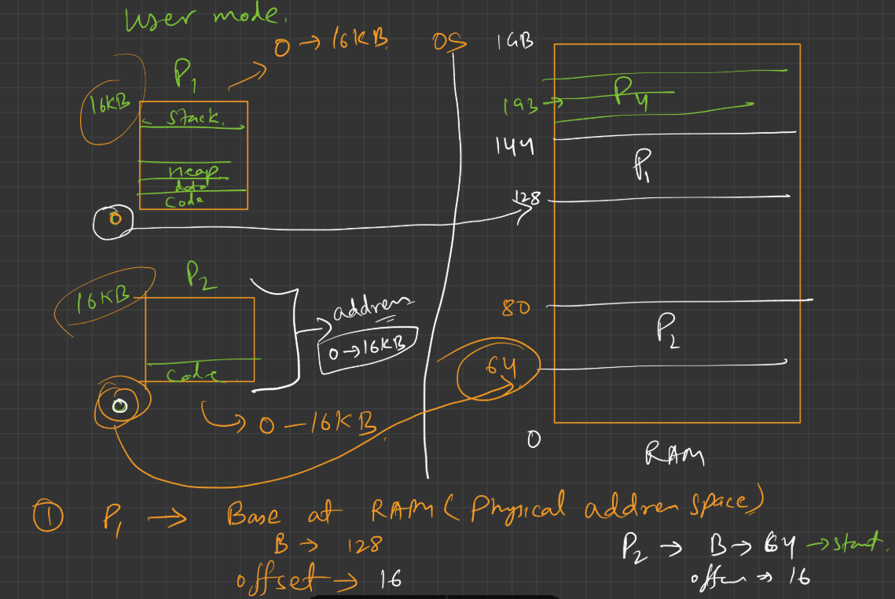

## 🛡️ How does this help in **Process Isolation**?

Here's how OS isolates processes:

### ✅ Each Process Has Its Own Logical Address Space

* Every process gets its own **logical address space** (e.g., 0 to 1,000,000).
* Two processes can both use logical address `0x1000`, but they map to **different physical addresses**.

> 🧠 Example:
>
> * Process A → Logical address `0x1000` → Physical `0x2000`
> * Process B → Logical address `0x1000` → Physical `0x5000`
>
> These are completely separate in physical memory, so one process **cannot access or modify** another's memory.

---

## 💡 Real-Life Analogy (in computer logic)

Imagine two apps (Google Chrome and VLC) running on your laptop.

* Both think they have memory starting from address 0.
* Chrome’s `address 0x1000` might point to a web page content.
* VLC’s `address 0x1000` might point to video data.

But because of **MMU and OS memory mapping**, Chrome’s and VLC’s memory are stored at **different physical locations**, and one can’t mess with the other.

---

## ✅ Summary: How OS Uses These to Isolate Processes

| Feature                              | How It Helps Isolation                                           |
| ------------------------------------ | ---------------------------------------------------------------- |
| Separate Logical Address Space       | Each process gets a private virtual world                        |
| MMU Address Translation              | Maps each process's logical address to different physical memory |
| No Direct Access to Physical Address | A process can’t see real memory layout                           |
| Protected Memory Management          | OS checks access; illegal access = termination                   |

---
---
---

## 🧠 Scenario Breakdown

### 🔹 Given:
- **Program A** (say P1): logical address `0 KB to 16 KB` → OS wants to load into **physical memory 128 KB to 144 KB**.
- **Program B** (say P2): logical address `0 KB to 16 KB` → OS wants to load into **physical memory 64 KB to 193 KB**.
- **Program P4** is **already running** and **occupies** some or all of **177 KB to 193 KB**.

---

## ❗ Problem:
**P2 is requesting access to memory that is already allocated to another program (P4).**  
This is **not allowed**. Let’s see how the OS handles this.

---

## ✅ How the OS Handles This Situation

### 🔒 1. **Memory Protection**
Operating systems use **memory protection** to **prevent programs from accessing memory** they don’t own.

- Each process gets **its own isolated memory space**.
- If P2 tries to access **177–193 KB**, which belongs to P4, the OS will **block it**.

### 📛 2. **Access Violation or Segmentation Fault**
If P2 tries to **"smart work"** and bypasses the OS’s memory allocation, then:

- **CPU’s Memory Management Unit (MMU)** detects the violation.
- The OS will **terminate P2 immediately** with an error like:
  > `Segmentation fault` or `Access violation`

This is a **security feature** to protect running processes.

---

## 💡 What if P2 Tries to Request That Space Normally?

If P2 says:
> "Hey OS, I want 64 KB to 193 KB."

Then:
- OS looks at its **memory map**.
- It sees that **177–193 KB is already occupied by P4**.
- So OS **denies** the request and returns:
  > ❌ “Cannot allocate memory” or assigns only part of the request (if possible, which is rare for a continuous range).

---

## 🛠️ What Will the OS Do Instead?

### 🟡 Option 1: **Allocate Different (Free) Memory**
- OS finds another free region (like 200 KB to 329 KB).
- Loads P2 there.
- P2 gets **logical address 0 to 129 KB**, but it maps to **different physical memory**.

### 🔵 Option 2: **Use Paging**
If OS uses paging:
- P2's 129 KB is divided into ~33 pages (e.g., 4 KB per page).
- OS maps each page to **any available physical frame**.
- Overlapping with P4 never happens, even if physical memory is tight.

---

## 🔐 Key Concepts Involved

| Concept | Description |
|--------|-------------|
| **Memory Protection** | Prevents one process from reading/writing another's memory |
| **MMU** | Maps logical to physical addresses and enforces protection |
| **Segmentation Fault** | Happens if a process accesses unauthorized memory |
| **Paging** | Splits memory into small chunks to avoid contiguous allocation needs |

---

## ✅ Final Answer Summary

> If **P2 tries to use 64–193 KB** but **P4 is already using 177–193 KB**,  
> **the OS will not allow it**.  
> Either the **request will be rejected**, or if P2 **tries to hack it**,  
> it will be **terminated with an access violation.**

The OS **always ensures memory safety and isolation** to avoid such conflicts.