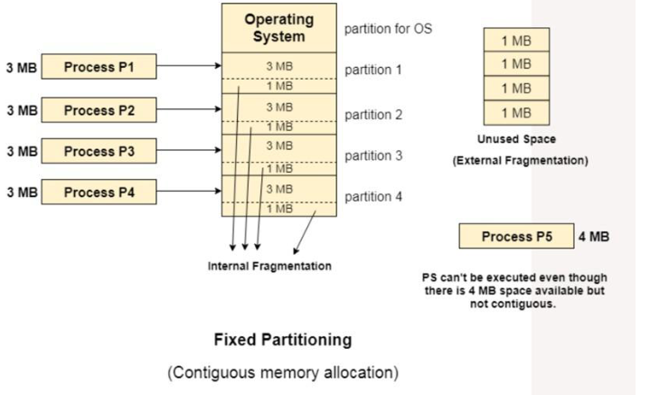

# 🧠 What is Contiguous Memory Allocation?

> **Contiguous** means: the memory block is continuous — all bytes are next to each other.

## 📘 a. In this scheme, each process is contained in a single, continuous block of memory.

---

# 🧱 b. Fixed Partitioning

### 🔧 What it means (Computer Logic):

* The whole main memory is divided into **fixed partitions**.
* These partitions can be:

  * Equal in size (e.g., all 3 MB each)
  * Or different sizes (e.g., 2 MB, 3 MB, 4 MB…)

### 👨‍🏫 Friendly Example:

Think of a parking lot with fixed-sized parking spots:

* Some spots fit small cars
* Some fit SUVs
* Some are empty
  But you can't change the size of a spot.

Each process (car) needs to fit **entirely into one parking spot (partition)**.

---

# 📊 Diagram Explanation (middle of your image)

The memory is divided like this:

* **Partition 1**: 3MB
* **Partition 2**: 1.5MB
* **Partition 3**: 3MB
* **Partition 4**: 1.5MB

Processes:

* P1, P2, P3, P4 fit nicely into partitions.
* P5 needs 4MB → **cannot fit** even though there's **total free space of 3 MB**.
  Why? Because it’s split into two parts (1MB + 2MB), and **not contiguous**.



## 🧠 Title: Fixed Partitioning (Contiguous Memory Allocation)

This diagram shows **how memory is managed using fixed-size partitions**, which is a simple but outdated memory management technique.

---

## 🔍 Diagram Components Breakdown

### 📌 1. **Memory Layout**
- The main memory is divided into **fixed partitions**:
  - **Partition 1 to Partition 4**
  - Each partition is **4 MB** (since 3 MB process + 1 MB unused).
- A section at the top is reserved for the **Operating System**.

---

### 📌 2. **Processes**
- **Process P1 to P4**: Each is **3 MB in size**, and they are loaded into partitions 1 to 4.
- There’s **1 MB left unused** in each partition because the process doesn’t use the full 4 MB → this is called **Internal Fragmentation**.

---

### 📌 3. **Internal Fragmentation**
- Happens when a process is **smaller than the partition size**.
- The remaining memory **inside** the partition is **wasted**.
- In this case: 1 MB wasted in each of the 4 partitions → 4 MB total internal waste.

---

### 📌 4. **External Fragmentation**
- After loading 4 processes, we have **no empty partitions left**, but there’s still **free memory scattered** across the system.
- The image shows **four 1 MB blocks** as unused but **non-contiguous** → this is called **external fragmentation**.

---

### 📌 5. **Process P5 – Can’t Be Loaded**
- **P5 is 4 MB in size**.
- Although total **free memory = 4 MB** (1 MB × 4), there’s **no single 4 MB continuous block** available.
- So the OS **can’t load P5** → it gets rejected.

---

## 🚫 Limitations of Fixed Partitioning

| Problem | Explanation |
|--------|-------------|
| **Internal Fragmentation** | Unused space *inside* a partition when the process is smaller than the partition. |
| **External Fragmentation** | Free space is scattered *outside* the partitions, but not usable unless contiguous. |
| **Inefficient** | Can’t run a large process unless an entire large partition is available. |
| **Rigid** | Partitions are fixed; memory can't be flexibly reused.

---

## ✅ Why It's Important
This is one of the **earliest memory management schemes** used in early operating systems. It's useful for understanding how **modern techniques like paging and segmentation** evolved to overcome these limitations.

---
---
---

## 🚫 ii. Limitations of Fixed Partitioning

Let’s explain all four limitations in very simple and visual-friendly ways.

---

### 🧩 1. **Internal Fragmentation**

🧠 **Computer logic**:

* When a process is **smaller** than the partition, the remaining space is wasted.
* Wasted space **inside** the partition = **internal fragmentation**.

👨‍🏫 **Friendly example**:

* You have a 3-liter bottle (partition), and you pour 2 liters of water (process) in it.
* 1 liter space is wasted inside the bottle — no one can use it.

📌 **Result**: Memory is wasted inside the partition.

---

### 🧱 2. **External Fragmentation**

🧠 **Computer logic**:

* When free memory exists but is **not in one single chunk**, a new process cannot be loaded even though there's enough total space.
* This is **external fragmentation**.

👨‍🏫 **Friendly example**:

* You want to park a 4-meter long bus (process P6), but the parking lot has:

  * One 2-meter space and one 2-meter space — but **not next to each other**.
* Even though total space is 4 meters, you can’t park the bus — because the space isn’t **continuous**.

📌 **Result**: Memory is wasted outside partitions, in gaps.

---

### 🔐 3. **Limitation on Process Size**

🧠 **Computer logic**:

* If a process is **larger than the largest partition**, it **cannot be loaded** at all.

👨‍🏫 **Friendly example**:

* Suppose the biggest parking spot (partition) is 3 meters.
* A truck of 4 meters (process P6) can’t park — it’s too big, no matter what.
* Even if you join small cars and ask them to scoot over — **you can’t split the truck into parts**.

📌 **Result**: Big programs simply can’t run unless the OS has a large-enough partition.

---

### 👥 4. **Low Degree of Multiprogramming**

🧠 **Computer logic**:

* Only **a limited number of partitions** means a limited number of processes can run.
* No partition = no new process.

👨‍🏫 **Friendly example**:

* If the parking lot has 4 spots, only 4 cars can park.
* The 5th car must wait outside — even if there's **total free space** in the parking lot due to fragmentation.

📌 **Result**: Wastes system power because you can’t fully load your CPU with processes.

---

## 📌 Summary Table

| Problem                     | Cause                                            | Type of Fragmentation | Wasted Where?          |
| --------------------------- | ------------------------------------------------ | --------------------- | ---------------------- |
| **Internal Fragmentation**  | Process smaller than partition                   | Internal              | Inside partitions      |
| **External Fragmentation**  | Free space spread out, not contiguous            | External              | Between partitions     |
| **Process Size Limitation** | Process bigger than any available partition      | -                     | Entire process blocked |
| **Low Multiprogramming**    | Fixed number of partitions = fixed process count | -                     | CPU under-utilized     |

---

## 💡 Why is this topic important?

This explains **why modern OSes moved to better systems** like:

* **Variable partitioning**
* **Paging**
* **Segmentation**

These methods solve the fragmentation issues and allow more efficient memory usage.

If you'd like, I can now:

* Explain **Variable Partitioning** and how it improves this
* Move on to **Paging and Segmentation** (non-contiguous allocation)

Let me know what you'd like next.

---
---
---

# 🔄 **Dynamic Partitioning (Contiguous Allocation)**

---

## 📘 i. What is Dynamic Partitioning?

> In this technique, **partition size is not pre-defined**. Instead, the size of the partition is **determined dynamically** at the time the process is loaded.

---

### 💻 Computer Logic Explanation:

* Memory is no longer chopped into fixed blocks.
* When a new process comes, a block **exactly the size of the process** is created.
* So:

  ```
  Partition size = Process size
  ```

---

### 👨‍🏫 Friendly Example:

Imagine a **flexible parking lot**:

* When a car comes in, the ground magically creates a spot **just the size of the car**.
* Small car? Small spot.
* Big truck? Big spot.
  No spot is too big or too small — everything fits just right.

---

### 📊 Diagram 1 (Top of the image):

Each process is loaded into a memory block **that matches its size**:

* P1 → 6 MB
* P2 → 2 MB
* P3 → 3 MB
* P4 → 4 MB

🟢 Perfect fit → **No unused internal space.**

---

## ✅ ii. Advantages Over Fixed Partitioning

---

### ✅ 1. **No Internal Fragmentation**

💻 **Logic**:

* Since partition = process size, there's **no extra unused memory inside a partition**.

👨‍🏫 **Analogy**:

* Every car gets a perfect-sized parking spot.
* No wasted space inside spots.

---

### ✅ 2. **No Limit on Process Size**

💻 **Logic**:

* In fixed partitioning, if the process is larger than the biggest partition, it can’t load.
* In dynamic partitioning, **there are no pre-sized partitions**, so even large processes can be loaded if enough total space exists.

👨‍🏫 **Analogy**:

* Big bus comes? The parking lot adjusts and gives it a big enough space.
* No rejection because of size.

---

### ✅ 3. **Better Degree of Multi-programming**

💻 **Logic**:

* More processes can be loaded since space is used more efficiently.
* Unlike fixed partitioning, memory isn’t wasted on unused gaps.

👨‍🏫 **Analogy**:

* Instead of leaving large parts of the parking lot unused (as in fixed partitioning), now every inch is used smartly.
* More cars (processes) can be parked (loaded) at once.

---

## ❌ iii. Limitation – **External Fragmentation**

---

### 📊 Diagram 2 (Bottom image):

After some processes finish and leave (P1 and P3), memory looks like this:

* Free block 1 = 5 MB
* Free block 2 = 3 MB
* Free block 3 = occupied (P2: 2 MB)
* Free block 4 = occupied (P4: 4 MB)

Now, a new process P5 (8 MB) arrives.

Even though total free memory = 5 MB + 3 MB = **8 MB**, the process **can’t be loaded**.

Why?

---

### ❌ External Fragmentation in Dynamic Partitioning:

💻 **Logic**:

* Free memory is **available**, but it is **not continuous** (not in one block).
* Since dynamic partitioning still uses contiguous blocks, the process needs 8 MB **in one go**.

👨‍🏫 **Analogy**:

* You want to park a bus that needs 8 meters.
* There's 5 meters free in one part of the lot and 3 meters free elsewhere.
* Total = 8 meters, but the bus can't split itself across two distant places.

---

### 💥 Summary Table: Fixed vs Dynamic Partitioning

| Feature                | Fixed Partitioning               | Dynamic Partitioning         |
| ---------------------- | -------------------------------- | ---------------------------- |
| Partition size         | Pre-defined                      | Defined at process load time |
| Internal Fragmentation | Yes                              | No                           |
| External Fragmentation | Yes                              | Yes                          |
| Limit on process size  | Yes (can't exceed largest part.) | No                           |
| Multi-programming      | Low                              | Better                       |
| Flexibility            | Low                              | High                         |

---

## 📌 Conclusion

Dynamic Partitioning solves many issues of Fixed Partitioning:

* No wasted internal space
* No hard limit on process size
* Better use of RAM = more processes can run

But it **still suffers from external fragmentation**, because memory must still be **contiguous** (in one block) for any process.

---

### ⏭️ What’s Next?

To solve **external fragmentation**, OS designers introduced:

* **Compaction** (moving processes around in memory)
* **Non-contiguous allocation** methods like:

  * **Paging** (divides memory into fixed-size pages/frames)
  * **Segmentation**

Would you like me to explain **Paging** next? It's a game-changer.