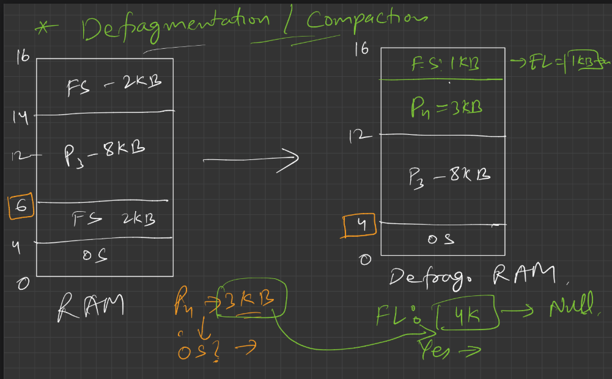

# 🌌 1. **Defragmentation / Compaction**

---

## 🧠 Problem: **External Fragmentation**

As you already learned from dynamic partitioning, **external fragmentation** happens when:

* There is enough **total** memory free
* BUT not in one **continuous block**.
* Hence, large processes **can’t be loaded**.

---

## 🔧 a. **What is Compaction?**

> Compaction (or Defragmentation) is a **memory reorganization technique**.

---

### 💻 **Computer Logic**:

* The OS **collects all free scattered memory blocks** (holes).
* It **shifts** the active processes together (side by side).
* Then it **combines all free memory** into **one big contiguous chunk**.

This makes it possible to load large processes that were earlier being rejected due to fragmentation.

---

### 👨‍🏫 **Friendly Analogy**:

Imagine your wardrobe is messy:

* Clothes are randomly placed.
* You have 3 shelves with empty space, but no shelf has enough space to fit your thick winter jacket.

What do you do?

> You **rearrange** your clothes — pack them neatly together — and then you **collect all empty space into one big shelf**.

Now the winter jacket fits. That’s **compaction**.

---

## 🌟 b. **Benefits of Compaction**

* Can now load large processes.
* Efficient use of total memory space.
* Reduces memory wastage due to fragmentation.

---

## ⚠️ c. Limitation: **System Efficiency Drops**

### 💻 Why?

Compaction takes **time and CPU power**, because:

* You have to **pause current processes**.
* Copy memory from one place to another.
* Update all pointers and references.

In short: **Compaction is heavy work** for the system.

---

### 👨‍🏫 Friendly View:

It’s like tidying your messy cupboard. It’s worth it, but:

* You have to **stop everything else**.
* It **takes time** and **effort**.

So while compaction is useful, it’s **not done frequently**.

## 🧠 What’s Happening in This Diagram

You're showing a **Before and After of Defragmentation (Compaction)** in RAM.

---

### 📦 BEFORE DEFRAGMENTATION (Left Side)

- Total RAM = 16 KB  
- Let's walk through what’s inside:

| Address | Block         | Size  |
|---------|---------------|-------|
| 0–4     | OS            | 4 KB  |
| 4–6     | FS (Free Space) | 2 KB  |
| 6–14    | P3            | 8 KB  |
| 14–16   | FS (Free Space) | 2 KB  |

You had **two free blocks** (2 KB + 2 KB) but **not continuous**, so a process like **P4 = 3 KB** can’t fit. That’s the **problem**.

---

### 🛠️ WHAT OS DOES (Compaction)

- The OS **pushes all processes down** to fill the holes.
- So now, all used memory is compacted to the lower side, and all **free space is combined** at the top.

---

### 📦 AFTER DEFRAGMENTATION (Right Side)

| Address | Block        | Size  |
|---------|--------------|-------|
| 0–4     | OS           | 4 KB  |
| 4–12    | P3           | 8 KB  |
| 12–15   | P4           | 3 KB  |
| 15–16   | FS           | 1 KB  |

So now:
- ✅ **P4 (3 KB)** can fit easily
- ✅ Only **1 KB** is left (called `FL0`)
- ✅ This is now pointed as the start of **free list** → `FL0 → 1K → null`

---

## 🤔 Extra Notes You Marked:

### 🟧 "OS?" near P4 → 2 KB
You were wondering: *“Can P4 go in that 2 KB free block?”*

- ❌ **No**, because P4 needs 3 KB.
- ✅ After compaction, it fits because 2 KB + 2 KB → **merged** to give 4 KB. P4 uses 3 KB, 1 KB remains.

---

## ✅ So What Did OS Do?

- Moved P3 and OS downward (no change for OS actually).
- Merged 2 free holes (2 KB + 2 KB) into one **4 KB chunk**.
- Loaded P4 into that new free space.
- Updated the **Free List** (FL0 = 1 KB).

---

## 🎯 Conclusion in Your Terms:

- OS **moves blocks down**, **merges free areas** = **compaction**
- This lets bigger processes (like P4) run
- After compaction → **less fragmentation**, **fewer wasted spots**
- Free space is now **continuous and trackable**