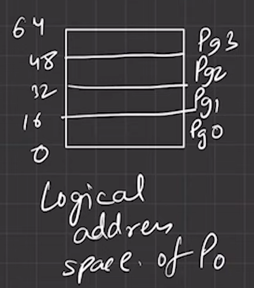

### 📄 **Page Table for Process 0**

| Page Number | Frame Number |
| ----------- | ------------ |
| Page 0      | Frame 3      |
| Page 1      | Frame 7      |
| Page 2      | Frame 5      |
| Page 3      | Frame 2      |

### 🧠 **Logical Addressing in Paging (Process 0 Example)**

### 📘 **Step 1: Logical Address Space**

* Process 0 has **64 bytes** of logical address space.
* To uniquely identify each byte →

  $$
  \log_2(64) = N \text{ bits}
  $$
  $$ 2^N = 64$$
  $$2^N = 2^6$$
  $$N = 6$$
* So, every **logical address** in this process is **6 bits long**.

### Each process has its own page table (becauese if another process has 3 pages then we have to draw another table )
### 📘 Process Isolation

* Yes, **each process has its own page table**.
* So if **Process 1** has only 3 pages, it will have a **different page table**, and its logical address will still be 6 bits **if its space is 64 bytes**, but the mapping will differ.

---

### ✅ Given:

* The total logical address space is **64 bytes**.
* It's divided into **4 pages** → Each page has `64 / 4 = 16 bytes`.
* You have a **logical address of 25 bytes** — we need to find:

  * **Page number**
  * **Offset within that page**

### 🧮 Step-by-Step Calculation:

#### Step 1: Determine **Page Size**

Each page = 16 bytes
So the page boundaries are:

* **Page 0:** 0 – 15
* **Page 1:** 16 – 31
* **Page 2:** 32 – 47
* **Page 3:** 48 – 63

#### Step 2: Logical Address = **25**

Look at where **25** falls:

* It lies in **Page 1**, because Page 1 spans from **16 to 31**.

### ✅ Bitwise Method:

#### 🧾 Given:

* Logical address space = **64 bytes**
* So we need **6 bits** to address it → Because $2^6 = 64$
* Page size = **16 bytes** → That’s $2^4$, so we need **4 bits for offset**

So:

* **Total address bits = 6**
* **Page number bits = 2**
* **Offset bits = 4**

That means:

* **First 2 bits** of the address → **Page number**
* **Last 4 bits** → **Offset**

### 🧮 Step-by-step for address `25`:

1. **Convert 25 to binary** →

   $$
   25_{10} = 011001_2
   $$

2. Split the bits:

   * First 2 bits → `01` → **Page number = 1**
   * Last 4 bits → `1001` → **Offset = 9**

### ✅ Final Answer:

* **Page number = 1**
* **Offset = 9**

it's a **binary-based method**, and it's often how operating systems actually handle virtual memory.

So, the **25th byte lies in Page 1** at the **9th byte position (offset 9)** within that page.

---
---
---

### To not get confused i used the ***pata*** bengali word of page, otherwise you will gets confused between the page of process and book page

### 📘 **Analogy: Process, Page, and Offset**

Let’s say:

* 🧠 **Process = Book**
  A process is like a **book** in memory. It contains a lot of information (code, data, stack, etc.).
  lets assume the a **Book** consists of 200 patas and its contains 20 chapters, so that means each chapter contains 10 patas

* 📄 **Page = Chapter**
  The book is broken down into **chapters**, just like a process's memory is divided into **pages**. Each page is a **fixed-size** chunk of memory (say, 4KB or 16 bytes in your example).
  1 chapter = 10 patas

* 🔢 **Offset = Pata number inside the chapter**
  When you open a chapter, the **offset** tells you **how far into the chapter** you want to go.
 
  chapter 1 contains - 1 to 10 patas
  chapter 2 contains - 11 to 20 patas
  chapter 3 contains - 21 to 30 patas
                ..
  
  It’s like saying:

  > “Go to Chapter 2, pata 15”

  Now you will find your content

### 🧠 So, when you access a logical address in memory:

* The **first few bits** tell you the **chapter number (page number)**
* The **remaining bits** tell you the **line number (offset)** inside that chapter

### ✅ Example with your analogy:

You have 64-byte memory and 16-byte pages.

Let’s say you want to access **logical address 25**:

* It’s like saying:
  **“Open Book: Process 0, go to Chapter 1 (Page 1), Pata 9 (Offset 9)”**

* In binary:
  `25 = 011001` →

  * Chapter = `01` = Page 1
  * Pata = `1001` = Offset 9

### 💡 Summary:

| Term    | Analogy     | Explanation                |
| ------- | ----------- | -------------------------- |
| Process | Book        | Whole program in memory    |
| Page    | Chapter     | Fixed-size piece of memory |
| Offset  | Pata number | Location within that page  |