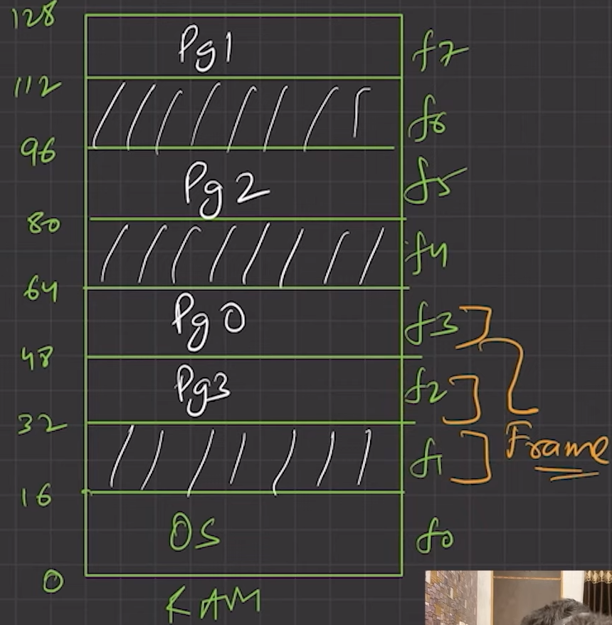

### From the 02_logical_address_space.md we defined the the page number + offset (i mean page mpping)
### Here we are gonna do the Frame mapping 

---

## 🧠 Concept: Paging and Address Translation

We are mapping a **logical address** (used by a process) to a **physical address** (actual RAM location) using a **page table** and **frame table**.

---

## 📘 Logical Address Recap

* Total **logical address space** = 64 bytes

* Page size = 16 bytes
  So:

  $$
  \frac{64}{16} = 4 \text{ pages} \Rightarrow \text{Need 2 bits for page number}
  $$

  $$
  \text{Each page has 16 bytes} = 2^4 \Rightarrow \text{Need 4 bits for offset}
  $$

* Logical address → **6 bits total = 2 bits (page) + 4 bits (offset)**

---

## 🟩 Example: Logical Address = **25**

### ✅ Step 1: Convert 25 to binary

$$
25 = 011001_2
$$

### ✅ Step 2: Extract parts

* First 2 bits: `01` → **Page number = 1**
* Last 4 bits: `1001` → **Offset = 9**

---

## 📄 Page Table of Process 0

| Page Number | Frame Number |
| ----------- | ------------ |
| Page 0      | Frame 3      |
| Page 1      | Frame 7      |
| Page 2      | Frame 5      |
| Page 3      | Frame 2      |

So Page 1 is stored in **Frame 7** (which in the diagram starts at **address 112** and ends at **127**).

---

## 🔄 Address Translation (MMU)

### ✅ Step 3: Calculate physical address

$$
\text{Physical Address} = \text{Frame base} + \text{Offset}
$$

$$
= 112 + 9 = \boxed{121}
$$

---

* Total **Physical memory space** = 128 bytes

* Frame size = 16 bytes
  So:
  $$
  \frac{128}{16} = 8 \text{ Frames}
  $$

* To uniquely identify each byte →

  $$
  \log_2(128) = N \text{ bits}
  $$
  $$ 2^N = 128$$
  $$2^N = 2^7$$
  $$N = 7$$

* So, every **Physical memory** in this process is **7 bits long**.

  $$
  \text{Each Frames has 16 bytes} = 2^4 \Rightarrow \text{Need 4 bits for offset}
  $$
* and rest 3 bits for **Frame** number

## 🧮 Binary of Physical Address = 121

$$
121 = 1111001_2
$$
so:

* First **3 bits** → Frame number
* Last **4 bits** → Offset inside frame

Split:

* `111` → Frame **7**
* `1001` → Offset **9**

---

## 🔀 Difference Between Logical and Physical Address

| Aspect         | Logical Address      | Physical Address      |
| -------------- | -------------------- | --------------------- |
| Format         | Page number + Offset | Frame number + Offset |
| Example        | `01 1001`            | `111 1001`            |
| Binary Address | `011001` (25)        | `1111001` (121)       |
| Translated via | Page Table           | MMU → Frame Table     |

---

## 🛠 MMU's Role

The **MMU (Memory Management Unit)** performs this:

> Take the **page number from the logical address**, use the **page table** to get the corresponding **frame number**, and then **construct the physical address** using that frame number and the **same offset**.

So the only thing that **changes** between logical and physical address is the **page number becoming a frame number** — the **offset stays the same**.