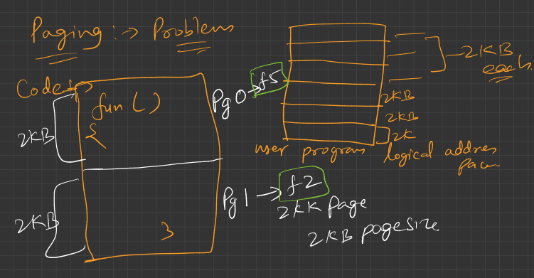
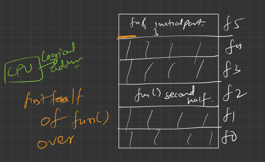

### 🔶 Diagram 1: "Paging → Problems"

#### What's going on here?

* You have a **user program** (on the left side) with some **code** that includes a function `fun()` and some other code.
* The **logical address space** is divided into **pages** (right side), each of **2 KB** in size.
* The function `fun()` spans across **two pages** — `Pg 0` and `Pg 1` — because it's larger than 2 KB.

These logical pages are mapped to **physical frames** like this:

* `Pg 0 → f5`
* `Pg 1 → f2`

This is perfectly valid in paging, but it leads to a problem…

---

### 🔶 Diagram 2: Execution + Fragmentation

#### What is shown?

* CPU tries to execute `fun()`.
* The **first half of `fun()`** (from page 0) is fetched and loaded from **frame 5** (i.e., physical memory).
* Now it needs to fetch the **second half** of `fun()` from page 1, which is stored in **frame 2**.

So function `fun()` is **not contiguous in memory**, and this leads to problems like:

---

### ❗ The Main Problem with Paging: **Code Fragmentation**

1. **Code splitting across pages**:

   * Function `fun()` is split across multiple pages (page 0 and page 1), which are stored in completely **different locations in physical memory** (frame 5 and frame 2).
   * This **hurts spatial locality**, which is crucial for fast execution (especially with caching).

2. **Performance Overhead**:

   * Fetching different parts of a single function from separate memory locations **increases memory access time**.
   * It may lead to **more page faults** if one part of the function is in memory and the other part is not.

3. **Poor Cache Utilization**:

   * Since code is not placed contiguously, caching becomes less effective.
   * This may cause **more TLB misses** and **poor CPU cache hit ratio**.

---

### ✅ Summary:

| Paging Strength                   | Paging Weakness (Shown Here)                 |
| --------------------------------- | -------------------------------------------- |
| Avoids external fragmentation     | Splits functions/data across multiple frames |
| Easy memory management with pages | Poor spatial locality, slows down execution  |
| Each page fits anywhere in memory | Hard to optimize for functions or loops      |

So while paging solves external fragmentation, it **causes internal fragmentation** (within a page) and **logical fragmentation of code**, which reduces performance.