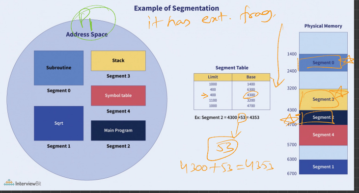

This diagram is a great visual representation of **segmentation** in memory management, not **paging**. Let's walk through what it's showing and how segmentation works.

---

## 🧠 What Is Segmentation?

Segmentation is a memory management technique where the **logical address space** (your program) is divided into **segments** of different sizes, based on logical divisions like:

* Functions (subroutine, `sqrt`)
* Data (`stack`, `symbol table`)
* Code (`main program`)

Each segment has:

* A **base address**: where it starts in physical memory.
* A **limit**: how big it is (maximum size).

---

## 🔍 Explanation of the Diagram

### 1. **Address Space (Logical View)** – Left Circle

This is the view from the **process's perspective**, and includes:

* Segment 0 → Subroutine
* Segment 1 → Sqrt
* Segment 2 → Main Program
* Segment 3 → Stack
* Segment 4 → Symbol Table

Each of these has its own **segment number**.

---

### 2. **Segment Table** – Middle Table

This maps **logical segments** to **physical memory**.

| Segment | Limit | Base (Physical Addr.) |
| ------- | ----- | --------------------- |
| 0       | 1000  | 1400                  |
| 1       | 1000  | 6700                  |
| 2       | 400   | 4300                  |
| 3       | 500   | 3200                  |
| 4       | 1000  | 4700                  |

So if you want something from Segment 2 at offset 53:

* Base = 4300
* Offset = 53
* Physical Address = 4300 + 53 = **4353**

👉 This is **shown with orange markings** in the image.

---

### 3. **Physical Memory** – Right Block

This shows the actual **locations in RAM**:

* Segment 0 is at 1400–2399
* Segment 1 is at 6700–7699
* Segment 2 is at 4300–4699
* Segment 3 is at 3200–3699
* Segment 4 is at 4700–5699

Note: These ranges are derived from `Base + Limit`.

---

## ✅ How Segmentation Solves the Problem

### 1. **Logical Separation**

* Code and data are separated logically.
* Stack, functions, and data don’t interfere with each other.

### 2. **No Internal Fragmentation**

* Since segments are sized exactly to what's needed (unlike fixed-size paging), there's **no internal fragmentation**.

### 3. **Efficient Memory Access**

* Logical address (segment, offset) → easily translated to physical address using Segment Table.

### 4. **Protection**

* Each segment has a limit, so you can’t accidentally access memory outside the segment.

---

## ⚠️ Common Confusion: Segmentation ≠ Paging

| Segmentation                 | Paging                        |
| ---------------------------- | ----------------------------- |
| Variable-sized segments      | Fixed-size pages              |
| Divides program logically    | Divides program physically    |
| Easier logical protection    | Simpler memory management     |
| Offset checked against limit | Offset just fits in page size |

---
---
---


## 🔍 Does this **example** show external fragmentation?

### ✅ Yes — it **does** imply **external fragmentation**, and here's how:

Look at the **physical memory layout** on the right side of the image:

```
[1400] Segment 0 (1000 bytes)
[2400] Free (800 bytes gap — not used)
[3200] Segment 3 (500 bytes)
[3700] Free (600 bytes gap — not used)
[4300] Segment 2 (400 bytes)
[4700] Segment 4 (1000 bytes)
[5700] Free (1000 bytes gap — not used)
[6700] Segment 1 (1000 bytes)
```

We can clearly see that:

* There are **gaps of unused memory** between the segments.
* These gaps are **not big enough individually** to hold some segments that might come later.

### ✅ Therefore, this is **external fragmentation**:

* Free spaces are **scattered**.
* You might have **enough total free memory**, but **not enough contiguous space** for a new segment.

---

## 🔎 Where is this explained in the image?

The image **does not explicitly explain** external fragmentation. However, it implies it by:

* Showing segments placed at **non-contiguous locations** in physical memory.
* Leaving visible **gaps** between segments.

You can infer the presence of external fragmentation by analyzing the **base addresses** in the **segment table** and observing how they skip around in physical memory.

---

## ✅ Summary:

| Observation                    | External Fragmentation Present? | Why?                                 |
| ------------------------------ | ------------------------------- | ------------------------------------ |
| Non-contiguous memory segments | ✅ Yes                           | Gaps between segments                |
| Unused memory between segments | ✅ Yes                           | Memory is free but not usable fully  |
| Explicit mention in image      | ❌ No                            | You have to **infer** it from layout |