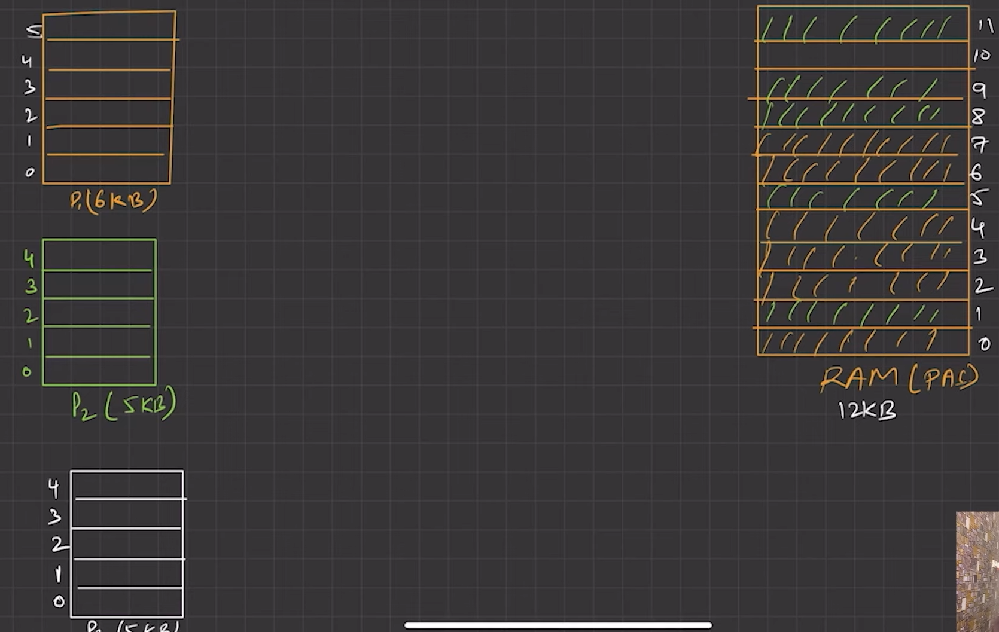

## 🕰️ OLD SYSTEM — Your Scenario

**System specs:**

* RAM = 12 KB (each frame = 1 KB → 12 frames total)
* 3 Processes:

  * P1 = 6 pages → 6 KB
  * P2 = 5 pages → 5 KB
  * P3 = 5 pages → 5 KB

🧠 The system can only fit **P1 + P2 = 11 KB**, and can't load **P3** due to lack of space.

> ❌ In old systems: if there isn’t enough **physical memory**, the process is rejected or waits.

---

## 🚀 MODERN SYSTEM — Huge Programs in Limited RAM

**Example:**

* GTA V = \~100+ GB (total with assets)
* Apps + OS = Several GB
* RAM = **only 16 GB**

🧠 Question: **How does it all still run?**

* The answer: **Virtual Memory + Paging + Swapping + Disk**

---

## 💡 Virtual Memory: The Game Changer

**Virtual memory** is an **illusion** created by the OS + hardware (MMU = Memory Management Unit) that makes it seem like:

> Each process has **its own big memory space**, even if RAM is small.

---

### 🧱 Let’s Compare RAM vs Virtual Memory

| Feature               | RAM (Physical) | Virtual Memory                         |
| --------------------- | -------------- | -------------------------------------- |
| Real hardware space   | Yes            | No (just logical)                      |
| Shared by all         | Yes            | Each process thinks it has its own     |
| Limited (e.g., 16 GB) | Yes            | Can be bigger (e.g., 256 TB on 64-bit) |
| Backed by disk        | No             | Yes (via page file/swap)               |

---

## 🔄 How It Works – Step by Step

### 1. **Programs are broken into Pages** (e.g., 4 KB)

* GTA V, Chrome, OS, etc. are all split into pages.

### 2. **Only the Needed Pages are Loaded**

* When you play GTA V, only the **code and data** you’re currently using (scene, logic, etc.) is loaded into RAM.
* The rest remains on disk or in cache.

> 🎮 Just like how Netflix **buffers** only the part you're watching.

---

### 3. **Page Fault & Demand Paging**

* If the process needs a page **not in RAM** → OS triggers a **page fault**.
* It **swaps out** an unused page from RAM to disk (page file/swap).
* Then it **loads the needed page from disk to RAM**.

> 🤯 You get **illusion of unlimited RAM** but OS is constantly juggling.

---

### 4. **Disk as Backup — Page File**

* Windows: `pagefile.sys`
* Linux: Swap space

These are parts of your hard disk used as **fake RAM**.

* Slower than real RAM
* But allows system to **run huge apps without crashing**

---

## 🔁 Example:

Let’s say you're running:

| App         | Virtual Memory Needed |
| ----------- | --------------------- |
| Chrome      | 2 GB                  |
| GTA V       | 6 GB                  |
| VS Code     | 1 GB                  |
| OS + Others | 4 GB                  |
| **Total**   | \~13 GB used actively |

You open GTA and it needs **some new asset** → not in RAM → OS:

1. Frees up RAM by swapping out less-used pages (e.g., Chrome tab).
2. Loads GTA’s needed pages into that space.
3. The game runs smoothly because the **player doesn’t need the whole game loaded at once**.

---

## 🧪 Summary: Virtual Memory Solves the RAM Problem

| Old Systems                        | Modern Systems                                 |
| ---------------------------------- | ---------------------------------------------- |
| Process rejected if not enough RAM | Uses virtual memory to load only what's needed |
| No backing store                   | Uses disk (swap/pagefile)                      |
| Limited multitasking               | Handles huge multitasking                      |
| External fragmentation             | Solved using Paging                            |

---

### 🔧 Key Components That Make It Work:

* Virtual address space (per process)
* Page table (maps virtual → physical memory)
* Page fault handling (on-demand loading)
* Swapping & page replacement algorithms (like LRU)
