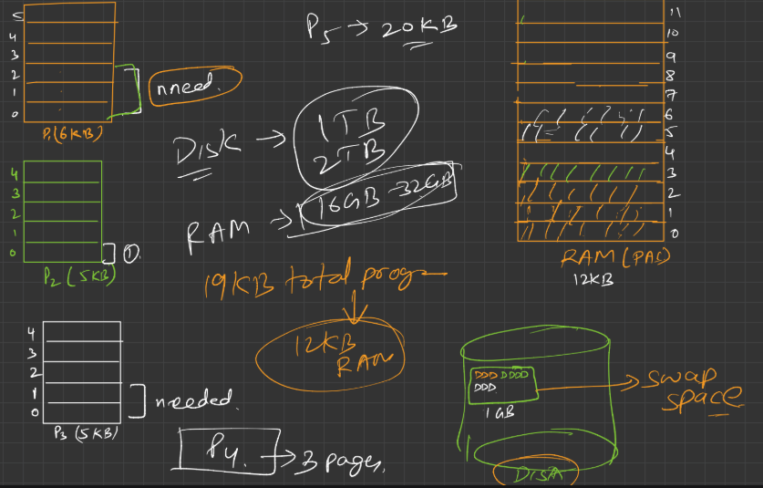

## ✅ RAM is 12 KB (12 Frames)

Each frame = 1 KB.

### Breakdown of RAM (Top Right - "RAM (PA)"):

* RAM frames numbered **0 to 11**
* Let's decode which pages of which processes are in RAM:

| Frame No. | Color                      | Contains            | Notes                                                   |
| --------- | -------------------------- | ------------------- | ------------------------------------------------------- |
| 0–2       | 🟧 Orange                  | `P1` Pages 0,1,2    | First 3 pages of `P1`                                   |
| 3         | 🟩 Green                   | `P2` Page 0         | First page of `P2`                                      |
| 4–5       | ⚪ White                    | `P3` Pages 0,1      | First 2 pages of `P3`                                   |
| 6–11      | Unused or possibly swapped | Could be used later | Only 6 KB in use here, other 6 KB may be used as needed |

So far, this uses:

* `3 KB` for `P1`
* `1 KB` for `P2`
* `2 KB` for `P3`
  → **Total: 6 KB currently used out of 12 KB**

Thus, half the RAM is still **free for loading other pages on demand** (like when page faults happen).

---

## ✅ Processes (From Left Side)

| Process | Color     | Pages   | In RAM           | In Swap/Disk |
| ------- | --------- | ------- | ---------------- | ------------ |
| `P1`    | 🟧 Orange | 6 pages | 0–2 in RAM       | 3–5 in disk  |
| `P2`    | 🟩 Green  | 5 pages | Page 0 in RAM    | 1–4 in disk  |
| `P3`    | ⚪ White   | 5 pages | Pages 0–1 in RAM | 2–4 in disk  |

---

## ✅ Disk (Bottom Right) - Swap Space

This represents the **secondary storage** (HDD/SSD) where unused or not-currently-needed pages are stored. These are brought in when needed and swapped with pages in RAM.

* OS uses a **page replacement algorithm** (like LRU, FIFO) to decide which page in RAM can be **swapped out**.
* When a page that is **not in RAM** is accessed → **page fault** occurs → required page is **swapped in**, some current page is **swapped out**.

---

## ✅ Main Idea (Conceptual Summary)

* Total Program Size = `P1 (6KB) + P2 (5KB) + P3 (5KB)` = **16 KB**
* RAM = **12 KB**
* So, only some **pages of each process can be loaded at a time**
* Rest are stored in **swap space (disk)**

### When a page is **needed**:

* OS loads it from swap space to RAM
* Possibly **evicts (swaps out)** an unused page to make space

This is **virtual memory** in action.

---

## ✅ Final Understanding (Corrected)

* 🟧 `P1` → Pages 0–2 in RAM; Pages 3–5 in swap
* 🟩 `P2` → Page 0 in RAM; Pages 1–4 in swap
* ⚪ `P3` → Pages 0–1 in RAM; Pages 2–4 in swap
* RAM has **6/12 pages in use**, ready to load others when needed
* OS uses **page replacement** to manage memory dynamically

---
---
---

### This is how the a 19kb processes will gonna run on the 12kb ram 